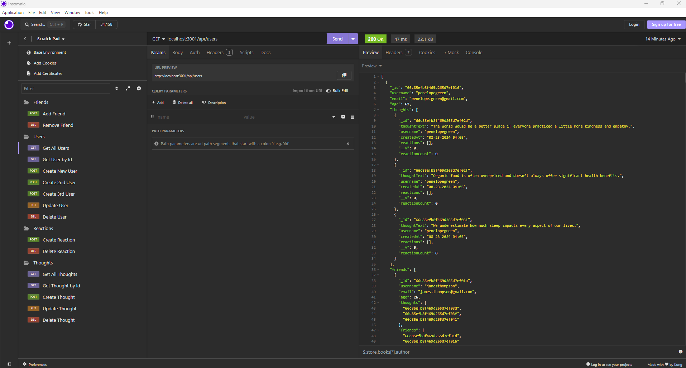

# Thought Portal
A Back-End application that tracks the Thoughts of users and other users' reactions to those Thoughts.
## Description
Thought Portal is a robust backend tool that allows users to post their Thoughts in a social media environment. When users see the thoughts of another user, they can post their reactions to the original Thought, stemming further thoughts and reactions by other users. This backend social media application allows for fun conversation about all types of Thoughts and Ideas. Using Insomnia, or another other API client, Thought Portal allows users to add, read, update or delete Thoughts. In addition, this app allows users the ability to add, read, update or delete Reactions to any Thoughts. Finally, Thought Portal allows users to add, read, update or delete Users. This powerful backend tool saves data in a MongoDB database and uses the Mongoose wrapper to facilitate communication between the client and MongoDB.
 

 
Click <a href="https://drive.google.com/file/d/1LIzeK4itG_waLpH7ojRhrRhHSpK2H38k/view" target="_blank">here</a> to view the walk-through video of Thought Portal.

 
## Table of Contents
1. [Installation](#installation)
2. [Usage](#usage)
3. [License](#license)
4. [Contributing](#contributing)
5. [Tests](#tests)
6. [Questions](#questions)
7. [Acknowledgements](#acknowledgements)

## Installation
npm install
npm run seed

## Usage
This repository is Public and can be used by anyone.

## License
This project is not currently licensed.

## Contributing
Please email me with any comments and suggestions about Thought Portal.

## Tests
npm run test

## Questions
If you have any questions about this Project or its Repository, I can be reached at <a href=mailto:brabur@yahoo.com>brabur@yahoo.com</a>.  You can also find more of my work at <a href="https://github.com/BradBurr-Github" target="_blank">BradBurr-Github</a>.

## Acknowledgements
None at this time.